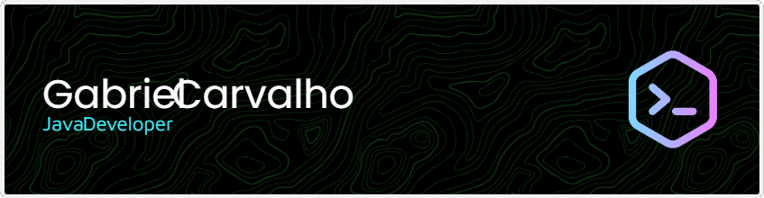

#  Bem-vind@ ao GitHub de Gabriel 🚀

Programador apaixonado por tecnologia e aprendizado contínuo. Sempre buscando resolver desafios e aprimorar minhas habilidades em desenvolvimento de software.

## Tecnologias 💻

 

## Estatísticas do Repositório
 

